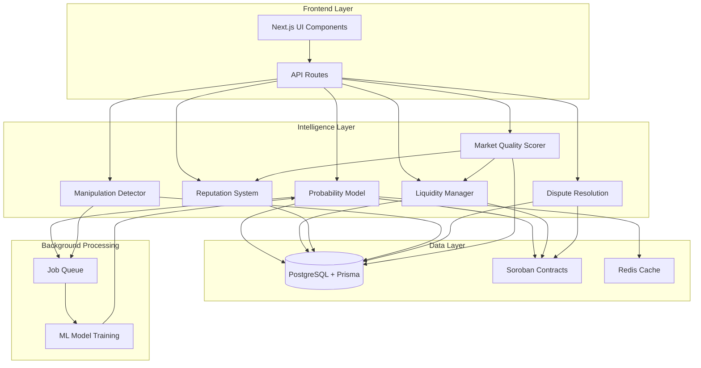

# Design Document: Advanced Prediction Market Intelligence

## Overview

This design extends the Gravity prediction market platform with intelligent market analysis, manipulation detection, reputation scoring, and decentralized dispute resolution while maintaining the existing ZK-sealed betting privacy guarantees.

The system adds a Market Intelligence Layer that operates on aggregate data and public commitments without compromising the privacy of individual bet positions. All intelligence features integrate with the existing Soroban smart contracts, Circom ZK circuits, and Prisma database schema.

### Key Design Principles

1. **Privacy-First**: All analytics operate on aggregate data; individual bet sides remain sealed
2. **Stellar-Native**: Leverage Stellar SDK and Soroban contract state for on-chain data
3. **Minimal Overhead**: Use caching, background jobs, and efficient queries to maintain performance
4. **Backward Compatible**: Extend existing schemas without breaking current functionality
5. **Modular Architecture**: Each intelligence component operates independently

### System Context

The existing Gravity platform consists of:
- **Frontend**: Next.js 16 with React 19, Tailwind CSS, Framer Motion
- **Blockchain**: Stellar Testnet with Soroban smart contracts (Rust)
- **ZK Proofs**: Circom circuits (seal_bet.circom, reveal_bet.circom) with SnarkJS
- **Database**: PostgreSQL with Prisma ORM
- **Wallet**: Freighter integration for transaction signing

The intelligence layer adds:
- **Probability Modeling**: AI-based market probability estimation
- **Liquidity Management**: Dynamic parameter adjustment
- **Reputation System**: User and oracle scoring
- **Manipulation Detection**: Pattern analysis and alerting
- **Dispute Resolution**: Decentralized challenge and voting mechanism

## Architecture

### High-Level Component Diagram



### Component Responsibilities

**Probability Model (PM)**
- Generates initial probability estimates for new markets
- Updates probabilities every 60 seconds (30 seconds for markets closing within 24h)
- Incorporates historical data, external signals, and trading volume
- Falls back to volume-weighted calculation if external data unavailable
- Stores probability history with timestamps

**Liquidity Manager (LM)**
- Adjusts minimum bet sizes based on trading volume
- Applies liquidity incentive multipliers for low-volume markets
- Manages weekly liquidity incentive pool distribution
- Adjusts creator bond requirements based on market volatility
- Recalculates parameters every 300 seconds

**Reputation System (RS)**
- Tracks user reputation scores (0-1000 scale)
- Assigns reputation tiers (Novice, Intermediate, Expert, Master)
- Monitors oracle reliability and resolution times
- Adjusts bond requirements based on creator reputation
- Calculates 30-day rolling averages

**Manipulation Detector (MD)**
- Monitors bet transactions in real-time (max 10s latency)
- Calculates manipulation risk scores (0-100)
- Detects rapid betting, volume spikes, wash trading, Sybil attacks
- Generates alerts for high-risk markets
- Maintains wallet relationship graph

**Dispute Resolution (DR)**
- Manages 48-hour challenge periods after market resolution
- Handles challenge submissions with evidence
- Coordinates 72-hour voting periods
- Calculates weighted vote totals
- Executes bond slashing and reward distribution

**Market Quality Scorer (MQ)**
- Calculates quality scores (0-100) using weighted factors
- Incorporates creator reputation (30%), oracle reliability (30%), liquidity (20%), clarity (20%)
- Updates scores every 3600 seconds
- Provides quality indicators for UI

## Components and Interfaces

### 1. Probability Model Service

**Location**: `lib/intelligence/probability-model.ts`

**Core Functions**:
```typescript
interface ProbabilityModel {
  generateInitialProbability(marketId: string): Promise<ProbabilityEstimate>
  updateProbability(marketId: string): Promise<ProbabilityEstimate>
  getProbabilityHistory(marketId: string, limit?: number): Promise<ProbabilityEstimate[]>
  calculateAccuracy(marketId: string): Promise<number>
}

interface ProbabilityEstimate {
  marketId: string
  probability: number  // 0.00 to 1.00
  timestamp: Date
  sources: DataSource[]
  confidence: number
}

type DataSource = 'historical' | 'external' | 'volume' | 'fallback'
```

**Data Sources**:
1. Historical market data (similar resolved markets with exponential decay weighting)
2. External event signals (placeholder for future API integrations)
3. Current trading volume (pool size changes)

**Update Strategy**:
- Background job runs every 30 seconds
- Checks all active markets
- Updates markets closing within 24h every cycle
- Updates other markets every 60 seconds (skip alternate cycles)
- Caches results with 60-second TTL

### 2. Liquidity Manager Service

**Location**: `lib/intelligence/liquidity-manager.ts`

**Core Functions**:
```typescript
interface LiquidityManager {
  calculateMinBetSize(marketId: string): Promise<number>
  getIncentiveMultiplier(marketId: string): Promise<number>
  adjustBondRequirement(marketId: string): Promise<number>
  distributeLiquidityRewards(): Promise<void>
  getLiquidityParams(marketId: string): Promise<LiquidityParams>
}

interface LiquidityParams {
  minBetSize: number  // 1-100 XLM
  incentiveMultiplier: number  // 1.0-1.10
  bondRequirement: number  // base + adjustments
  lastUpdated: Date
}
```

**Adjustment Rules**:
- Volume > 1000 XLM/hour → increase min bet by 10%
- Volume < 100 XLM/24h → decrease min bet by 10%
- Pool < 500 XLM → apply 1.05× incentive multiplier
- Volatility > 0.20/hour → increase bond by 20%

**Reward Distribution**:
- Weekly pool: 1000 XLM
- Reward points = bet_amount / 10 for low-liquidity markets
- Distribution proportional to accumulated points
- Reset points at start of each week

### 3. Reputation System Service

**Location**: `lib/intelligence/reputation-system.ts`

**Core Functions**:
```typescript
interface ReputationSystem {
  initializeUser(publicKey: string): Promise<void>
  updateOnBetResult(userId: string, won: boolean): Promise<void>
  updateOnMarketResolution(marketId: string, disputed: boolean): Promise<void>
  calculateOracleReliability(oracleAddress: string): Promise<number>
  getReputationTier(score: number): ReputationTier
  getUserReputation(publicKey: string): Promise<UserReputation>
}

interface UserReputation {
  score: number  // 0-1000
  tier: ReputationTier
  rollingAverage: number
  totalBets: number
  winRate: number
}

type ReputationTier = 'Novice' | 'Intermediate' | 'Expert' | 'Master'

interface OracleMetrics {
  totalResolutions: number
  disputedResolutions: number
  reliability: number  // 0.00-1.00
  avgResolutionTime: number  // hours
}
```

**Score Adjustments**:
- New user: 500 initial score
- Win bet: +5 points
- Lose bet: -2 points
- Market resolved without dispute: +20 points (creator)
- Market successfully disputed: -100 points (oracle)
- Bounds: [0, 1000]

**Oracle Penalties**:
- Reliability < 0.80 → flag for review
- Avg resolution time > 72h → -10 points

### 4. Manipulation Detector Service

**Location**: `lib/intelligence/manipulation-detector.ts`

**Core Functions**:
```typescript
interface ManipulationDetector {
  analyzeBet(bet: Bet): Promise<void>
  calculateRiskScore(marketId: string): Promise<number>
  detectWashTrading(marketId: string): Promise<WashTradingAlert | null>
  detectSybilAccounts(addresses: string[]): Promise<SybilCluster[]>
  getMarketRisk(marketId: string): Promise<MarketRisk>
}

interface MarketRisk {
  score: number  // 0-100
  flags: RiskFlag[]
  lastUpdated: Date
}

type RiskFlag = 
  | { type: 'rapid_betting', userId: string, count: number }
  | { type: 'volume_spike', increase: number }
  | { type: 'wash_trading', confidence: number, accounts: string[] }
  | { type: 'sybil_cluster', accounts: string[], fundingSource: string }

interface SybilCluster {
  accounts: string[]
  fundingSource: string
  confidence: number
}
```

**Detection Patterns**:
1. Rapid betting: >10 bets from same user in 60s
2. Volume spike: >500% increase in 1 hour
3. Wash trading: opposite-side bets within 600s
4. Sybil detection: same funding source + same market bets

**Risk Scoring**:
- Base score: 0
- Each flag adds points based on severity
- Rapid betting: +10
- Volume spike: +20
- Wash trading: +30
- Sybil cluster: +40
- Alert threshold: 70
- Auto-extend dispute: 85

### 5. Dispute Resolution Service

**Location**: `lib/intelligence/dispute-resolution.ts`

**Core Functions**:
```typescript
interface DisputeResolution {
  submitChallenge(params: ChallengeParams): Promise<Challenge>
  submitVote(disputeId: string, vote: Vote): Promise<void>
  finalizeDispute(disputeId: string): Promise<DisputeResult>
  getDisputeStatus(marketId: string): Promise<DisputeStatus>
}

interface ChallengeParams {
  marketId: string
  challengerAddress: string
  evidence: Evidence
  proposedOutcome: 'YES' | 'NO'
  bond: number  // 100 XLM
}

interface Evidence {
  description: string  // max 1000 chars
  urls: string[]  // max 3 URLs
}

interface Vote {
  voterAddress: string
  outcome: 'YES' | 'NO' | 'ORIGINAL'
  stake: number  // min 10 XLM
  weight: number  // reputation / 1000
}

interface DisputeResult {
  accepted: boolean
  totalVotes: number
  weightedVotes: { [outcome: string]: number }
  bondDistribution: { [address: string]: number }
}
```

**Challenge Flow**:
1. Market resolves → 48h challenge period opens
2. User submits challenge with 100 XLM bond + evidence
3. Challenge extends period by 24h
4. 72h voting period opens
5. Users with reputation > 300 can vote (min 10 XLM stake)
6. Votes weighted by reputation / 1000
7. >50% weighted votes → challenge accepted
8. Accepted: return bond + 50 XLM reward, slash oracle bond
9. Rejected: distribute bond to opposing voters

### 6. Market Quality Scorer Service

**Location**: `lib/intelligence/quality-scorer.ts`

**Core Functions**:
```typescript
interface QualityScorer {
  calculateQualityScore(marketId: string): Promise<number>
  getQualityBreakdown(marketId: string): Promise<QualityBreakdown>
}

interface QualityBreakdown {
  totalScore: number  // 0-100
  creatorReputation: number  // 30% weight
  oracleReliability: number  // 30% weight
  liquidityDepth: number  // 20% weight
  marketClarity: number  // 20% weight
}
```

**Calculation Formula**:
```
qualityScore = (
  (creatorReputation / 1000) * 30 +
  (oracleReliability) * 30 +
  (min(liquidityPool / 1000, 1)) * 20 +
  (clarityScore) * 20
)

clarityScore = min((titleLength + descLength) / 200, 1)
```

## Data Models

### Prisma Schema Extensions

```prisma
// Extend existing User model
model User {
  // ... existing fields ...
  reputationScore    Int       @default(500)
  reputationTier     String    @default("Intermediate")
  oracleReliability  Float?
  totalResolutions   Int       @default(0)
  disputedResolutions Int      @default(0)
  avgResolutionTime  Float?
  
  challenges         DisputeChallenge[]
  votes              DisputeVote[]
  liquidityRewards   LiquidityReward[]
}

// Extend existing Market model
model Market {
  // ... existing fields ...
  qualityScore       Float?
  manipulationScore  Float     @default(0)
  minBetSize         Float     @default(10)
  incentiveMultiplier Float    @default(1.0)
  volatility         Float     @default(0)
  
  probabilityHistory ProbabilityHistory[]
  challenges         DisputeChallenge[]
  riskFlags          ManipulationAlert[]
}

model ProbabilityHistory {
  id          String   @id @default(cuid())
  marketId    String
  market      Market   @relation(fields: [marketId], references: [id])
  probability Float
  confidence  Float
  sources     Json
  createdAt   DateTime @default(now())
  
  @@index([marketId, createdAt])
}

model DisputeChallenge {
  id              String   @id @default(cuid())
  marketId        String
  market          Market   @relation(fields: [marketId], references: [id])
  challengerId    String
  challenger      User     @relation(fields: [challengerId], references: [publicKey])
  
  evidence        String   // JSON: { description, urls }
  proposedOutcome String   // "YES" | "NO"
  bond            Float    @default(100)
  status          String   @default("PENDING")  // PENDING | ACCEPTED | REJECTED
  
  votingEndsAt    DateTime
  createdAt       DateTime @default(now())
  
  votes           DisputeVote[]
  
  @@index([marketId])
  @@index([status])
}

model DisputeVote {
  id          String   @id @default(cuid())
  disputeId   String
  dispute     DisputeChallenge @relation(fields: [disputeId], references: [id])
  voterId     String
  voter       User     @relation(fields: [voterId], references: [publicKey])
  
  outcome     String   // "YES" | "NO" | "ORIGINAL"
  stake       Float
  weight      Float
  createdAt   DateTime @default(now())
  
  @@unique([disputeId, voterId])
  @@index([disputeId])
}

model ManipulationAlert {
  id          String   @id @default(cuid())
  marketId    String
  market      Market   @relation(fields: [marketId], references: [id])
  
  flagType    String   // "rapid_betting" | "volume_spike" | "wash_trading" | "sybil_cluster"
  severity    String   // "INFO" | "WARNING" | "CRITICAL"
  details     Json
  resolved    Boolean  @default(false)
  createdAt   DateTime @default(now())
  
  @@index([marketId])
  @@index([severity, resolved])
}

model LiquidityReward {
  id          String   @id @default(cuid())
  userId      String
  user        User     @relation(fields: [userId], references: [publicKey])
  
  weekStart   DateTime
  points      Float
  reward      Float?
  claimed     Boolean  @default(false)
  createdAt   DateTime @default(now())
  
  @@index([userId, weekStart])
}

model WalletRelationship {
  id          String   @id @default(cuid())
  sourceWallet String
  targetWallet String
  relationship String   // "funded_by" | "co_bets"
  confidence  Float
  createdAt   DateTime @default(now())
  
  @@unique([sourceWallet, targetWallet, relationship])
  @@index([sourceWallet])
  @@index([targetWallet])
}

model SystemAlert {
  id          String   @id @default(cuid())
  type        String   // "manipulation" | "dispute" | "oracle_delay" | "liquidity"
  severity    String   // "INFO" | "WARNING" | "CRITICAL"
  message     String
  metadata    Json
  resolved    Boolean  @default(false)
  createdAt   DateTime @default(now())
  
  @@index([severity, resolved])
  @@index([createdAt])
}
```


## Correctness Properties

*A property is a characteristic or behavior that should hold true across all valid executions of a system—essentially, a formal statement about what the system should do. Properties serve as the bridge between human-readable specifications and machine-verifiable correctness guarantees.*

### Property Reflection

After analyzing all acceptance criteria, I identified several areas of redundancy:

1. **API Endpoint Properties**: Multiple criteria test API availability (1.8, 2.7, 3.8, 4.10, 5.8, 6.8, etc.). These are consolidated into example-based integration tests rather than separate properties.

2. **Update Frequency Properties**: Properties 1.2, 1.5, 3.6, 11.6, 13.2, 14.1 all test periodic update behavior. These can be combined into a general "periodic update" property per component.

3. **Threshold-Based Alerting**: Properties 6.6, 14.2, 14.3, 14.4, 14.5 all follow the pattern "when X exceeds threshold, alert". These can be combined into a general alerting property.

4. **Score Bounds**: Properties 1.4, 4.6, 6.4, 11.1 all test that scores remain within valid ranges. These can be combined into a general bounds-checking property.

5. **Reputation Adjustments**: Properties 4.2, 4.3, 4.4, 4.5 all test reputation score changes. These can be combined into a single property about reputation updates.

6. **Privacy Constraints**: Properties 15.1, 15.2, 15.3, 15.5, 15.7 all verify privacy preservation. These can be combined into a comprehensive privacy property.

The following properties represent the unique, non-redundant validation requirements:

### Property 1: Probability Estimate Bounds

*For any* market, the generated probability estimate must be a decimal value between 0.00 and 1.00 inclusive with exactly two decimal places of precision.

**Validates: Requirements 1.4**

### Property 2: Probability Update Frequency

*For any* active market, if the market close time is more than 24 hours away, then probability updates must occur at least every 60 seconds; if the close time is within 24 hours, then updates must occur at least every 30 seconds.

**Validates: Requirements 1.2, 1.5**

### Property 3: Probability Fallback Behavior

*For any* market where external data sources are unavailable, the probability model must fall back to volume-weighted calculation using only pool size data.

**Validates: Requirements 1.7**

### Property 4: Historical Data Retention

*For any* market resolved within the past 90 days, all probability history records and final outcome data must be retrievable from the database.

**Validates: Requirements 2.3**

### Property 5: Exponential Decay Weighting

*For any* new probability estimate, the weights applied to similar historical markets must follow exponential decay with factor 0.95^days_ago, where days_ago is the number of days since the historical market resolved.

**Validates: Requirements 2.5**

### Property 6: Liquidity Parameter Bounds

*For any* market, the minimum bet size must always be between 1 XLM and 100 XLM inclusive, regardless of volume-based adjustments.

**Validates: Requirements 3.3**

### Property 7: Volume-Based Bet Size Adjustment

*For any* market, if trading volume exceeds 1000 XLM in 1 hour, then the minimum bet size must increase by 10%; if volume falls below 100 XLM in 24 hours, then the minimum bet size must decrease by 10%.

**Validates: Requirements 3.1, 3.2**

### Property 8: Low-Liquidity Incentive

*For any* market with total liquidity pool below 500 XLM, the liquidity incentive multiplier must be set to 1.05× for winning payouts.

**Validates: Requirements 3.4, 12.2**

### Property 9: Reputation Score Bounds

*For any* user, the reputation score must always be between 0 and 1000 inclusive, regardless of wins, losses, or penalties applied.

**Validates: Requirements 4.6**

### Property 10: Reputation Updates

*For any* bet resolution, if the user won, their reputation score must increase by 5 points (capped at 1000); if the user lost, their reputation score must decrease by 2 points (floored at 0).

**Validates: Requirements 4.2, 4.3**

### Property 11: Reputation Tier Assignment

*For any* reputation score, the assigned tier must be: Novice if score ∈ [0, 299], Intermediate if score ∈ [300, 599], Expert if score ∈ [600, 799], or Master if score ∈ [800, 1000].

**Validates: Requirements 4.8**

### Property 12: Oracle Reliability Calculation

*For any* oracle with at least one resolution, the reliability score must equal (1 - disputed_count / total_resolutions) with a minimum value of 0.00.

**Validates: Requirements 5.3**

### Property 13: Oracle Flagging Threshold

*For any* oracle, if their reliability score falls below 0.80, the system must flag the oracle account for review.

**Validates: Requirements 5.4**

### Property 14: Manipulation Risk Score Bounds

*For any* market, the manipulation risk score must be between 0 and 100 inclusive.

**Validates: Requirements 6.4**

### Property 15: Rapid Betting Detection

*For any* user, if they place more than 10 bets on the same market within 60 seconds, the manipulation detector must flag the activity as suspicious.

**Validates: Requirements 6.2**

### Property 16: Volume Spike Detection

*For any* market, if total bet volume increases by more than 500% within 1 hour, the manipulation detector must generate a volatility alert.

**Validates: Requirements 6.3**

### Property 17: Wash Trading Detection

*For any* pair of users, if they consistently bet on opposite sides of the same markets within 600 seconds, the manipulation detector must flag potential wash trading.

**Validates: Requirements 7.2**

### Property 18: Sybil Risk Score Adjustment

*For any* set of accounts funded from the same source wallet within 24 hours that subsequently bet on the same market, the manipulation risk score for that market must increase by 30 points.

**Validates: Requirements 7.4**

### Property 19: Challenge Period Opening

*For any* market that transitions to RESOLVED status, a 48-hour challenge period must be opened immediately.

**Validates: Requirements 8.1**

### Property 20: Challenge Bond Requirement

*For any* challenge submission, the challenger must provide exactly 100 XLM as a dispute bond.

**Validates: Requirements 8.2**

### Property 21: Challenge Evidence Constraints

*For any* challenge submission, the evidence description must not exceed 1000 characters and must include at most 3 external URL references.

**Validates: Requirements 8.3**

### Property 22: Duplicate Challenge Prevention

*For any* user and market combination, the system must prevent the same user from submitting more than one challenge.

**Validates: Requirements 8.7**

### Property 23: Voting Eligibility

*For any* user with reputation score above 300, they must be allowed to cast exactly one vote per dispute.

**Validates: Requirements 9.2**

### Property 24: Vote Weighting

*For any* vote cast, the vote weight must equal the voter's reputation score divided by 1000.

**Validates: Requirements 9.3**

### Property 25: Dispute Resolution Threshold

*For any* dispute, if the challenge receives more than 50% of weighted votes, then the original market resolution must be overturned.

**Validates: Requirements 9.6**

### Property 26: Challenge Reward Distribution

*For any* accepted challenge, the challenger must receive their 100 XLM bond back plus a 50 XLM reward; for any rejected challenge, the 100 XLM bond must be distributed proportionally to voters who voted against the challenge.

**Validates: Requirements 9.7, 9.8**

### Property 27: Evidence URL Validation

*For any* evidence URL submitted, the system must validate that the URL is accessible and returns HTTP status 200; if inaccessible, it must be marked as unavailable.

**Validates: Requirements 10.2, 10.3**

### Property 28: Evidence Hiding Threshold

*For any* piece of evidence, if it receives more than 10 misleading flags, the system must hide the evidence with a warning message.

**Validates: Requirements 10.5**

### Property 29: Quality Score Calculation

*For any* market, the quality score must be calculated as: (creatorReputation/1000 × 30) + (oracleReliability × 30) + (min(liquidityPool/1000, 1) × 20) + (clarityScore × 20), resulting in a value between 0 and 100.

**Validates: Requirements 11.1, 11.2, 11.3, 11.4, 11.5**

### Property 30: Low-Liquidity Classification

*For any* market with total volume below 200 XLM, the system must classify it as a low-liquidity market.

**Validates: Requirements 12.1**

### Property 31: Liquidity Reward Points Calculation

*For any* bet placed on a low-liquidity market, the user must be credited with reward points equal to bet_amount / 10.

**Validates: Requirements 12.4**

### Property 32: Weekly Reward Distribution

*For any* weekly incentive period end, the 1000 XLM incentive pool must be distributed proportionally to users based on their accumulated reward points, and all reward points must be reset to zero.

**Validates: Requirements 12.5, 12.6**

### Property 33: Alert Threshold Triggering

*For any* market with manipulation risk score exceeding 70, or oracle with delayed resolution beyond 24 hours, or platform liquidity below 5000 XLM, the system must generate an alert notification.

**Validates: Requirements 6.6, 14.2, 14.4, 14.5**

### Property 34: Privacy-Preserving Aggregation

*For any* aggregate statistic calculation (volume, probability, manipulation detection), the system must compute the result using only commitment hashes, nullifiers, and pool size changes—never accessing individual bet sides.

**Validates: Requirements 15.1, 15.2, 15.3, 15.5, 15.7**

### Property 35: Differential Privacy Guarantee

*For any* user-level statistic, the system must apply differential privacy with epsilon value of 1.0.

**Validates: Requirements 15.4**

### Property 36: Performance Bounds

*For any* batch of 100 active markets, probability updates must complete within 10 seconds; for any incoming bet transaction, manipulation analysis must complete within 5 seconds; for any bet resolution, reputation update must complete within 2 seconds.

**Validates: Requirements 17.1, 17.2, 17.3**

### Property 37: Rate Limiting

*For any* user, API requests to intelligence endpoints must be limited to 100 requests per minute.

**Validates: Requirements 17.8**

## Error Handling

### Error Categories

**1. External Service Failures**
- Stellar RPC unavailable → cache last known state, retry with exponential backoff
- External data sources down → fall back to volume-weighted probability calculation
- Database connection lost → queue operations in memory, retry on reconnect

**2. Invalid Input**
- Probability out of bounds → clamp to [0.00, 1.00]
- Reputation score out of bounds → clamp to [0, 1000]
- Invalid evidence URLs → mark as unavailable, continue processing
- Malformed challenge data → reject with 400 error

**3. Business Logic Violations**
- Duplicate challenge from same user → reject with 409 error
- Insufficient reputation for voting → reject with 403 error
- Challenge after period expired → reject with 410 error
- Insufficient bond amount → reject with 402 error

**4. Performance Degradation**
- Slow probability calculation → return cached value with stale indicator
- Database query timeout → return partial results with warning
- High manipulation detection latency → queue for background processing

### Error Response Format

```typescript
interface ErrorResponse {
  error: string
  code: string
  details?: any
  retryable: boolean
}
```

### Logging Strategy

- All errors logged to console with timestamp and context
- Critical errors (manipulation alerts, dispute failures) logged to SystemAlert table
- Performance issues logged with metrics for monitoring
- Privacy violations logged with full audit trail

## Testing Strategy

### Dual Testing Approach

The system uses both unit tests and property-based tests for comprehensive coverage:

**Unit Tests**: Verify specific examples, edge cases, and integration points
**Property Tests**: Verify universal properties across randomized inputs

### Property-Based Testing Configuration

**Library**: fast-check (JavaScript/TypeScript property-based testing)
**Iterations**: Minimum 100 per property test
**Tagging**: Each test references its design property

Example property test structure:
```typescript
import fc from 'fast-check'

// Feature: advanced-prediction-market-intelligence, Property 1: Probability Estimate Bounds
test('probability estimates are always between 0.00 and 1.00', () => {
  fc.assert(
    fc.asyncProperty(
      fc.record({
        marketId: fc.string(),
        historicalData: fc.array(fc.float({ min: 0, max: 1 })),
        volume: fc.float({ min: 0, max: 10000 })
      }),
      async ({ marketId, historicalData, volume }) => {
        const estimate = await probabilityModel.generateInitialProbability(marketId)
        expect(estimate.probability).toBeGreaterThanOrEqual(0.00)
        expect(estimate.probability).toBeLessThanOrEqual(1.00)
        expect(estimate.probability.toFixed(2)).toBe(estimate.probability.toString())
      }
    ),
    { numRuns: 100 }
  )
})
```

### Unit Test Focus Areas

1. **API Endpoint Integration**: Verify all new endpoints return correct status codes and data formats
2. **Database Schema**: Verify migrations apply correctly and relationships work
3. **Edge Cases**: Empty markets, zero liquidity, first user, first challenge
4. **Error Conditions**: Invalid inputs, missing data, service failures
5. **UI Components**: Quality score display, risk indicators, dispute forms

### Test Organization

```
/tests
  /unit
    /intelligence
      probability-model.test.ts
      liquidity-manager.test.ts
      reputation-system.test.ts
      manipulation-detector.test.ts
      dispute-resolution.test.ts
      quality-scorer.test.ts
    /api
      markets.test.ts
      intelligence.test.ts
      disputes.test.ts
  /property
    probability-properties.test.ts
    liquidity-properties.test.ts
    reputation-properties.test.ts
    manipulation-properties.test.ts
    dispute-properties.test.ts
    privacy-properties.test.ts
  /integration
    end-to-end.test.ts
```

### Testing Priorities

Given the user constraint to minimize testing overhead, focus on:
1. Property tests for core correctness (Properties 1-37)
2. Unit tests for API endpoints and database operations
3. Integration tests for critical flows (challenge → vote → resolution)
4. Skip exhaustive edge case testing; rely on property tests for coverage


## Implementation Details

### Technology Stack Integration

**Stellar SDK Integration**
- Use existing `lib/escrow.ts` patterns for RPC calls
- Read market state via `getMarket(marketId)` function
- Monitor on-chain events for real-time bet detection
- No modifications to Soroban contracts required

**Prisma ORM**
- Extend existing schema with new models (see Data Models section)
- Use transactions for atomic operations (challenge + vote)
- Implement database indexes on frequently queried fields
- Use Prisma's connection pooling for concurrent requests

**Next.js API Routes**
- Create new routes under `/app/api/intelligence/`
- Use Next.js 16 App Router conventions
- Implement route handlers with proper TypeScript types
- Return JSON responses with appropriate status codes

**Background Jobs**
- Use Node.js `setInterval` for periodic tasks (simple, no external dependencies)
- Probability updates: 30-second interval
- Liquidity adjustments: 300-second interval
- Quality score updates: 3600-second interval
- Manipulation monitoring: real-time on bet events

**Caching Strategy**
- In-memory cache using Map for probability estimates (60s TTL)
- In-memory cache for quality scores (60s TTL)
- No external Redis required for MVP
- Cache invalidation on market resolution

### API Endpoints

#### Probability Model

**GET /api/markets/[id]/probability**
```typescript
Response: {
  marketId: string
  probability: number
  confidence: number
  sources: string[]
  lastUpdated: string
}
```

**GET /api/analytics/accuracy**
```typescript
Response: {
  overallAccuracy: number
  byCategory: { [category: string]: number }
  recentMarkets: Array<{
    marketId: string
    predictedProbability: number
    actualOutcome: string
    accuracy: number
  }>
}
```

#### Liquidity Management

**GET /api/markets/[id]/liquidity**
```typescript
Response: {
  minBetSize: number
  incentiveMultiplier: number
  bondRequirement: number
  isLowLiquidity: boolean
  lastUpdated: string
}
```

**GET /api/liquidity/incentives**
```typescript
Response: {
  currentWeek: {
    startDate: string
    endDate: string
    poolSize: number
    totalPoints: number
  }
  userRewards: {
    points: number
    estimatedReward: number
  }
}
```

#### Reputation System

**GET /api/users/[publicKey]/reputation**
```typescript
Response: {
  score: number
  tier: string
  rollingAverage: number
  totalBets: number
  winRate: number
  history: Array<{
    date: string
    score: number
    event: string
  }>
}
```

**GET /api/oracles/[address]/reliability**
```typescript
Response: {
  reliability: number
  totalResolutions: number
  disputedResolutions: number
  avgResolutionTime: number
  flagged: boolean
}
```

#### Manipulation Detection

**GET /api/markets/[id]/risk**
```typescript
Response: {
  score: number
  flags: Array<{
    type: string
    severity: string
    details: any
    timestamp: string
  }>
  lastUpdated: string
}
```

#### Dispute Resolution

**POST /api/disputes/challenge**
```typescript
Request: {
  marketId: string
  challengerAddress: string
  evidence: {
    description: string
    urls: string[]
  }
  proposedOutcome: 'YES' | 'NO'
  bond: number
}

Response: {
  challengeId: string
  votingEndsAt: string
}
```

**POST /api/disputes/[id]/vote**
```typescript
Request: {
  voterAddress: string
  outcome: 'YES' | 'NO' | 'ORIGINAL'
  stake: number
}

Response: {
  voteId: string
  weight: number
}
```

**GET /api/markets/[id]/disputes**
```typescript
Response: {
  challenges: Array<{
    id: string
    challenger: string
    evidence: any
    proposedOutcome: string
    status: string
    votingEndsAt: string
    votes: {
      YES: number
      NO: number
      ORIGINAL: number
    }
  }>
}
```

**GET /api/disputes/[id]/evidence**
```typescript
Response: {
  description: string
  urls: Array<{
    url: string
    accessible: boolean
    flags: number
  }>
  submittedAt: string
}
```

#### Market Quality

**GET /api/markets/[id]/quality**
```typescript
Response: {
  totalScore: number
  breakdown: {
    creatorReputation: number
    oracleReliability: number
    liquidityDepth: number
    marketClarity: number
  }
  lastUpdated: string
}
```

#### Analytics Dashboard

**GET /api/analytics/dashboard**
```typescript
Response: {
  activeMarkets: number
  totalLiquidity: number
  volume24h: number
  highRiskMarkets: Array<{
    marketId: string
    title: string
    riskScore: number
  }>
  pendingDisputes: Array<{
    marketId: string
    challengeId: string
    votesCount: number
  }>
  oracleMetrics: Array<{
    address: string
    reliability: number
    avgResolutionTime: number
  }>
}
```

**GET /api/alerts**
```typescript
Response: {
  alerts: Array<{
    id: string
    type: string
    severity: string
    message: string
    metadata: any
    resolved: boolean
    createdAt: string
  }>
}
```

### Background Job Implementation

**Probability Update Job** (`lib/jobs/probability-updater.ts`)
```typescript
export class ProbabilityUpdater {
  private interval: NodeJS.Timeout | null = null
  
  start() {
    this.interval = setInterval(async () => {
      const markets = await prisma.market.findMany({
        where: { status: 'OPEN' }
      })
      
      for (const market of markets) {
        const closeTime = new Date(market.closeDate).getTime()
        const now = Date.now()
        const hoursUntilClose = (closeTime - now) / (1000 * 60 * 60)
        
        // Update every cycle if closing within 24h, else skip alternate cycles
        if (hoursUntilClose <= 24 || this.shouldUpdateThisCycle(market.id)) {
          await probabilityModel.updateProbability(market.id)
        }
      }
    }, 30000) // 30 seconds
  }
  
  stop() {
    if (this.interval) clearInterval(this.interval)
  }
  
  private shouldUpdateThisCycle(marketId: string): boolean {
    // Simple alternating logic based on market ID hash
    return parseInt(marketId.slice(-1), 16) % 2 === 0
  }
}
```

**Liquidity Adjustment Job** (`lib/jobs/liquidity-adjuster.ts`)
```typescript
export class LiquidityAdjuster {
  private interval: NodeJS.Timeout | null = null
  
  start() {
    this.interval = setInterval(async () => {
      const markets = await prisma.market.findMany({
        where: { status: 'OPEN' }
      })
      
      for (const market of markets) {
        await liquidityManager.calculateMinBetSize(market.id)
        await liquidityManager.getIncentiveMultiplier(market.id)
        await liquidityManager.adjustBondRequirement(market.id)
      }
    }, 300000) // 5 minutes
  }
  
  stop() {
    if (this.interval) clearInterval(this.interval)
  }
}
```

**Manipulation Monitor** (`lib/jobs/manipulation-monitor.ts`)
```typescript
export class ManipulationMonitor {
  async onBetPlaced(bet: Bet) {
    // Real-time analysis on bet event
    await manipulationDetector.analyzeBet(bet)
    
    const risk = await manipulationDetector.calculateRiskScore(bet.marketId)
    
    if (risk > 70) {
      await this.sendAlert({
        type: 'manipulation',
        severity: risk > 85 ? 'CRITICAL' : 'WARNING',
        message: `High manipulation risk detected for market ${bet.marketId}`,
        metadata: { marketId: bet.marketId, riskScore: risk }
      })
    }
  }
  
  private async sendAlert(alert: any) {
    await prisma.systemAlert.create({ data: alert })
    // Future: webhook notifications
  }
}
```

### Database Migration Strategy

1. Create migration file: `prisma/migrations/XXX_add_intelligence_features/migration.sql`
2. Add new tables: ProbabilityHistory, DisputeChallenge, DisputeVote, ManipulationAlert, LiquidityReward, WalletRelationship, SystemAlert
3. Extend existing tables: User (add reputation fields), Market (add intelligence fields)
4. Create indexes on frequently queried fields
5. Run migration: `npx prisma migrate dev`
6. Generate Prisma client: `npx prisma generate`

### Frontend Integration

**Market Card Enhancement** (`components/MarketsGrid.tsx`)
- Add quality score badge
- Add risk indicator for high manipulation scores
- Add AI probability estimate display
- Color-code based on quality tier

**New Components**
- `components/DisputeModal.tsx`: Challenge submission form
- `components/VoteModal.tsx`: Dispute voting interface
- `components/ReputationBadge.tsx`: User reputation display
- `components/QualityIndicator.tsx`: Market quality visualization
- `components/RiskAlert.tsx`: Manipulation warning banner

**Dashboard Enhancements**
- Add intelligence metrics to admin dashboard
- Display pending disputes
- Show high-risk markets
- Oracle performance leaderboard

### Deployment Considerations

**Environment Variables**
```env
# Existing
DATABASE_URL=
NEXT_PUBLIC_SOROBAN_RPC_URL=
NEXT_PUBLIC_ESCROW_CONTRACT_ID=

# New (optional)
INTELLIGENCE_CACHE_TTL=60
PROBABILITY_UPDATE_INTERVAL=30000
LIQUIDITY_UPDATE_INTERVAL=300000
MANIPULATION_ALERT_THRESHOLD=70
```

**Startup Sequence**
1. Initialize database connection
2. Start background jobs (probability updater, liquidity adjuster)
3. Initialize in-memory caches
4. Register bet event listeners for manipulation monitoring
5. Start Next.js server

**Monitoring**
- Log all background job executions with timing
- Track API endpoint response times
- Monitor cache hit rates
- Alert on job failures

### Performance Optimizations

**Database Queries**
- Use `select` to fetch only needed fields
- Implement pagination for large result sets
- Use database indexes on: marketId, userPublicKey, timestamp, reputationScore, status
- Batch updates where possible (reputation score updates)

**Caching**
- Cache probability estimates for 60 seconds
- Cache quality scores for 60 seconds
- Cache oracle reliability metrics for 300 seconds
- Invalidate cache on market resolution

**Background Processing**
- Use Promise.all for parallel market updates
- Limit concurrent database connections
- Implement exponential backoff for retries
- Queue computationally intensive tasks

**API Rate Limiting**
- Implement per-user rate limiting: 100 req/min
- Use in-memory counter with sliding window
- Return 429 status code when limit exceeded
- Include rate limit headers in responses


## Privacy Preservation

### ZK Architecture Compatibility

The intelligence system maintains the existing ZK privacy guarantees:

**Sealed Positions Remain Private**
- Individual bet sides (YES/NO) are never accessed by intelligence components
- Only commitment hashes and nullifiers are used for analysis
- Probability models use aggregate pool sizes, not individual bet amounts
- Manipulation detection analyzes patterns of commitments, not bet directions

**Privacy-Preserving Analytics**

1. **Volume Calculation**: Derived from total pool changes
   ```typescript
   // CORRECT: Privacy-preserving
   const volume = market.totalPool - previousTotalPool
   
   // WRONG: Would break privacy
   const volume = bets.reduce((sum, bet) => sum + bet.amount, 0)
   ```

2. **Manipulation Detection**: Uses commitment timing and amounts
   ```typescript
   // CORRECT: Analyze commitment patterns
   const rapidBetting = commitments.filter(c => 
     c.timestamp > now - 60000 && c.bettor === userId
   ).length > 10
   
   // WRONG: Would require accessing bet sides
   const washTrading = bets.filter(b => b.side === 'YES').length === 
                       bets.filter(b => b.side === 'NO').length
   ```

3. **Probability Estimation**: Uses only aggregate data
   ```typescript
   // CORRECT: Use pool sizes
   const impliedProbability = market.yesPool / market.totalPool
   
   // WRONG: Would require counting individual bets
   const probability = bets.filter(b => b.side === 'YES').length / bets.length
   ```

### Differential Privacy Implementation

For user-level statistics, apply differential privacy with ε = 1.0:

```typescript
function addNoise(value: number, sensitivity: number, epsilon: number): number {
  const scale = sensitivity / epsilon
  const noise = laplacianNoise(scale)
  return value + noise
}

function laplacianNoise(scale: number): number {
  const u = Math.random() - 0.5
  return -scale * Math.sign(u) * Math.log(1 - 2 * Math.abs(u))
}

// Example: User win rate with differential privacy
async function getUserWinRate(publicKey: string): Promise<number> {
  const user = await prisma.user.findUnique({
    where: { publicKey },
    include: { bets: true }
  })
  
  const wins = user.bets.filter(b => b.revealed && /* won */).length
  const total = user.bets.filter(b => b.revealed).length
  
  if (total === 0) return 0.5
  
  const rawWinRate = wins / total
  const sensitivity = 1 / total  // Maximum change from one bet
  const epsilon = 1.0
  
  return Math.max(0, Math.min(1, addNoise(rawWinRate, sensitivity, epsilon)))
}
```

### Privacy Audit Log

All data access patterns are logged:

```typescript
interface PrivacyAuditEntry {
  timestamp: Date
  component: string
  operation: string
  dataAccessed: string[]
  aggregationLevel: 'individual' | 'market' | 'platform'
  privacyPreserving: boolean
}

// Example audit entry
{
  timestamp: new Date(),
  component: 'ProbabilityModel',
  operation: 'updateProbability',
  dataAccessed: ['market.totalPool', 'market.yesPool', 'market.noPool'],
  aggregationLevel: 'market',
  privacyPreserving: true
}
```

### Constraints Enforcement

**Compile-Time Checks**
- TypeScript types prevent accessing `bet.side` field (not in Prisma schema)
- Bet model only includes: commitment, nullifier, amount, revealed flag

**Runtime Checks**
- Validate that aggregate functions don't iterate over individual bet sides
- Assert that manipulation detection uses only commitment metadata
- Log warning if any component attempts to access sealed data

**Code Review Checklist**
- [ ] No access to bet.side or equivalent private fields
- [ ] All volume calculations use pool deltas
- [ ] Manipulation detection uses commitment patterns only
- [ ] Probability models use aggregate data only
- [ ] Differential privacy applied to user-level stats
- [ ] Privacy audit log entries created for all data access

## Integration with Existing Systems

### Soroban Contract Integration

**Read-Only Operations**
- Use existing `getMarket(marketId)` function to read on-chain state
- Use `getOnchainMarketCount()` to discover new markets
- Use `isNullifierSpent(nullifier)` to verify claims
- No contract modifications required

**Event Monitoring**
- Listen for `bet` events to trigger manipulation detection
- Listen for `resolved` events to open challenge periods
- Listen for `claim` events to update reputation scores

**Example Integration**:
```typescript
import { getMarket } from '@/lib/escrow'

async function syncMarketFromChain(contractMarketId: number) {
  const onChainMarket = await getMarket(contractMarketId)
  
  if (!onChainMarket) return
  
  await prisma.market.update({
    where: { contractMarketId },
    data: {
      status: onChainMarket.status,
      outcome: onChainMarket.outcome,
      totalVolume: onChainMarket.total_pool,
      yesPool: onChainMarket.yes_pool,
      noPool: onChainMarket.no_pool
    }
  })
}
```

### Prisma Schema Compatibility

**Backward Compatible Extensions**
- All new fields have default values
- Existing queries continue to work
- New fields are optional in existing API responses

**Migration Path**:
1. Add new fields to existing models with defaults
2. Create new tables for intelligence features
3. Run migration without downtime
4. Gradually populate new fields via background jobs
5. Update API responses to include new data

**Example Migration**:
```sql
-- Add new fields to User table
ALTER TABLE "User" ADD COLUMN "reputationScore" INTEGER DEFAULT 500;
ALTER TABLE "User" ADD COLUMN "reputationTier" TEXT DEFAULT 'Intermediate';
ALTER TABLE "User" ADD COLUMN "oracleReliability" DOUBLE PRECISION;

-- Add new fields to Market table
ALTER TABLE "Market" ADD COLUMN "qualityScore" DOUBLE PRECISION;
ALTER TABLE "Market" ADD COLUMN "manipulationScore" DOUBLE PRECISION DEFAULT 0;
ALTER TABLE "Market" ADD COLUMN "minBetSize" DOUBLE PRECISION DEFAULT 10;

-- Create indexes
CREATE INDEX "User_reputationScore_idx" ON "User"("reputationScore");
CREATE INDEX "Market_manipulationScore_idx" ON "Market"("manipulationScore");
```

### Frontend Component Integration

**Existing Components Enhanced**
- `MarketsGrid.tsx`: Add quality score badge, risk indicator
- `BetModal.tsx`: Display AI probability estimate, show liquidity incentives
- `Navbar.tsx`: Add reputation badge to user profile
- `Dashboard.tsx`: Add intelligence metrics section

**New Components Added**
- `DisputeModal.tsx`: Challenge submission form
- `VoteModal.tsx`: Dispute voting interface
- `ReputationBadge.tsx`: Tier-based reputation display
- `QualityIndicator.tsx`: Color-coded quality score
- `RiskAlert.tsx`: Warning banner for high-risk markets
- `IntelligenceDashboard.tsx`: Admin analytics view

**Example Enhancement**:
```typescript
// Enhanced MarketsGrid.tsx
export default function MarketsGrid() {
  const [markets, setMarkets] = useState<any[]>([])
  const [intelligence, setIntelligence] = useState<Map<string, any>>(new Map())
  
  useEffect(() => {
    async function fetchData() {
      const marketsRes = await fetch('/api/markets')
      const marketsData = await marketsRes.json()
      setMarkets(marketsData.markets)
      
      // Fetch intelligence data for each market
      for (const market of marketsData.markets) {
        const [quality, probability, risk] = await Promise.all([
          fetch(`/api/markets/${market.id}/quality`).then(r => r.json()),
          fetch(`/api/markets/${market.id}/probability`).then(r => r.json()),
          fetch(`/api/markets/${market.id}/risk`).then(r => r.json())
        ])
        
        setIntelligence(prev => new Map(prev).set(market.id, {
          quality, probability, risk
        }))
      }
    }
    fetchData()
  }, [])
  
  return (
    <div className="grid grid-cols-1 md:grid-cols-2 lg:grid-cols-3 gap-6">
      {markets.map(market => {
        const intel = intelligence.get(market.id)
        return (
          <MarketCard 
            key={market.id}
            market={market}
            qualityScore={intel?.quality.totalScore}
            aiProbability={intel?.probability.probability}
            riskScore={intel?.risk.score}
          />
        )
      })}
    </div>
  )
}
```

### API Route Organization

**New Route Structure**:
```
/app/api
  /intelligence
    /probability
      /[marketId]
        route.ts          # GET probability estimate
    /quality
      /[marketId]
        route.ts          # GET quality score
    /risk
      /[marketId]
        route.ts          # GET manipulation risk
    /reputation
      /[publicKey]
        route.ts          # GET user reputation
    /oracle
      /[address]
        route.ts          # GET oracle metrics
  /disputes
    /challenge
      route.ts            # POST new challenge
    /[id]
      /vote
        route.ts          # POST vote
      /evidence
        route.ts          # GET evidence
  /liquidity
    /incentives
      route.ts            # GET incentive status
  /analytics
    /dashboard
      route.ts            # GET dashboard metrics
    /accuracy
      route.ts            # GET prediction accuracy
  /alerts
    route.ts              # GET system alerts
```

**Backward Compatibility**:
- Existing routes unchanged: `/api/markets`, `/api/bets`, `/api/users`
- New intelligence routes are additive
- Existing frontend components work without modifications
- New features are opt-in via new API calls

### ZK Circuit Compatibility

**No Circuit Modifications Required**
- `seal_bet.circom` remains unchanged
- `reveal_bet.circom` remains unchanged
- Existing proof generation and verification logic untouched

**Intelligence Layer Uses Circuit Outputs**
- Commitments from seal circuit used for manipulation detection
- Nullifiers from reveal circuit used for claim tracking
- No new circuits needed for intelligence features

**Privacy Guarantee Maintained**
- Bet sides remain private in ZK proofs
- Intelligence system never accesses witness data
- Only public signals (commitment, nullifier) are used

## Scalability Considerations

### Database Optimization

**Indexing Strategy**:
```sql
-- High-frequency queries
CREATE INDEX idx_market_status ON "Market"("status");
CREATE INDEX idx_market_close_date ON "Market"("closeDate");
CREATE INDEX idx_bet_market_user ON "Bet"("marketId", "userPublicKey");
CREATE INDEX idx_bet_commitment ON "Bet"("commitment");
CREATE INDEX idx_probability_history_market_time ON "ProbabilityHistory"("marketId", "createdAt");
CREATE INDEX idx_dispute_status ON "DisputeChallenge"("status");
CREATE INDEX idx_alert_severity_resolved ON "SystemAlert"("severity", "resolved");

-- Composite indexes for complex queries
CREATE INDEX idx_user_reputation_tier ON "User"("reputationScore", "reputationTier");
CREATE INDEX idx_market_quality_risk ON "Market"("qualityScore", "manipulationScore");
```

**Query Optimization**:
- Use `select` to fetch only needed fields
- Implement cursor-based pagination for large result sets
- Use `include` sparingly; prefer separate queries for related data
- Batch database operations where possible

**Connection Pooling**:
- Prisma handles connection pooling automatically
- Configure max connections based on deployment environment
- Monitor connection usage and adjust pool size

### Caching Strategy

**In-Memory Cache Implementation**:
```typescript
class IntelligenceCache {
  private cache = new Map<string, { value: any, expiry: number }>()
  
  set(key: string, value: any, ttlSeconds: number) {
    this.cache.set(key, {
      value,
      expiry: Date.now() + ttlSeconds * 1000
    })
  }
  
  get(key: string): any | null {
    const entry = this.cache.get(key)
    if (!entry) return null
    
    if (Date.now() > entry.expiry) {
      this.cache.delete(key)
      return null
    }
    
    return entry.value
  }
  
  invalidate(pattern: string) {
    for (const key of this.cache.keys()) {
      if (key.includes(pattern)) {
        this.cache.delete(key)
      }
    }
  }
}

export const intelligenceCache = new IntelligenceCache()
```

**Cache Keys**:
- `probability:${marketId}` - TTL: 60s
- `quality:${marketId}` - TTL: 60s
- `risk:${marketId}` - TTL: 30s
- `reputation:${publicKey}` - TTL: 300s
- `oracle:${address}` - TTL: 300s

**Cache Invalidation**:
- On market resolution: invalidate all market-related caches
- On bet placement: invalidate risk cache
- On reputation update: invalidate user reputation cache
- On dispute resolution: invalidate market and oracle caches

### Background Job Scaling

**Job Distribution**:
- Probability updates: Process markets in batches of 20
- Liquidity adjustments: Process markets in batches of 50
- Manipulation monitoring: Real-time, no batching
- Quality score updates: Process markets in batches of 100

**Concurrency Control**:
```typescript
async function processBatch<T>(
  items: T[],
  batchSize: number,
  processor: (item: T) => Promise<void>
) {
  for (let i = 0; i < items.length; i += batchSize) {
    const batch = items.slice(i, i + batchSize)
    await Promise.all(batch.map(processor))
  }
}

// Example usage
const markets = await prisma.market.findMany({ where: { status: 'OPEN' } })
await processBatch(markets, 20, async (market) => {
  await probabilityModel.updateProbability(market.id)
})
```

**Error Handling in Jobs**:
- Log errors but continue processing other items
- Implement exponential backoff for transient failures
- Alert on repeated failures for same market
- Track job execution metrics

### API Performance

**Response Time Targets**:
- GET endpoints: < 200ms (p95)
- POST endpoints: < 500ms (p95)
- Background jobs: < 10s per batch

**Optimization Techniques**:
- Return cached data when available
- Use database indexes for fast lookups
- Implement pagination for large result sets
- Compress responses with gzip
- Use HTTP/2 for multiplexing

**Load Testing**:
- Test with 1000 concurrent users
- Verify 100 req/min rate limit works correctly
- Monitor database connection pool usage
- Check memory usage under load

### Horizontal Scaling

**Stateless Design**:
- No server-side session state
- All state in database or cache
- Background jobs can run on any instance
- API routes are stateless

**Multi-Instance Deployment**:
- Use load balancer to distribute requests
- Coordinate background jobs with leader election
- Share cache across instances (future: Redis)
- Database connection pooling per instance

**Future Enhancements**:
- Redis for distributed caching
- Message queue for background jobs (Bull, BullMQ)
- Separate worker processes for compute-intensive tasks
- Database read replicas for query scaling


## Security Considerations

### Input Validation

**API Request Validation**:
```typescript
// Example: Challenge submission validation
function validateChallengeRequest(req: any): ValidationResult {
  const errors: string[] = []
  
  if (!req.marketId || typeof req.marketId !== 'string') {
    errors.push('Invalid marketId')
  }
  
  if (!req.challengerAddress || !isValidStellarAddress(req.challengerAddress)) {
    errors.push('Invalid challenger address')
  }
  
  if (!req.evidence?.description || req.evidence.description.length > 1000) {
    errors.push('Evidence description must be 1-1000 characters')
  }
  
  if (!Array.isArray(req.evidence?.urls) || req.evidence.urls.length > 3) {
    errors.push('Evidence must include 0-3 URLs')
  }
  
  if (req.bond !== 100) {
    errors.push('Challenge bond must be exactly 100 XLM')
  }
  
  return { valid: errors.length === 0, errors }
}
```

**SQL Injection Prevention**:
- Use Prisma's parameterized queries (automatic protection)
- Never construct raw SQL with user input
- Validate all input types before database operations

**XSS Prevention**:
- Sanitize evidence descriptions before display
- Validate URLs before rendering
- Use React's built-in XSS protection
- Escape user-generated content in API responses

### Authentication & Authorization

**Wallet-Based Authentication**:
- Verify Stellar signatures for sensitive operations
- Challenge submission requires signature verification
- Vote submission requires signature verification
- Reputation updates triggered by on-chain events only

**Authorization Checks**:
```typescript
// Example: Vote authorization
async function authorizeVote(voterAddress: string, disputeId: string): Promise<boolean> {
  // Check reputation requirement
  const user = await prisma.user.findUnique({ where: { publicKey: voterAddress } })
  if (!user || user.reputationScore <= 300) {
    return false
  }
  
  // Check for duplicate vote
  const existingVote = await prisma.disputeVote.findUnique({
    where: { disputeId_voterId: { disputeId, voterId: voterAddress } }
  })
  if (existingVote) {
    return false
  }
  
  // Check voting period
  const dispute = await prisma.disputeChallenge.findUnique({ where: { id: disputeId } })
  if (!dispute || new Date() > dispute.votingEndsAt) {
    return false
  }
  
  return true
}
```

**Rate Limiting**:
```typescript
class RateLimiter {
  private requests = new Map<string, number[]>()
  
  isAllowed(userId: string, limit: number, windowMs: number): boolean {
    const now = Date.now()
    const userRequests = this.requests.get(userId) || []
    
    // Remove old requests outside window
    const recentRequests = userRequests.filter(time => now - time < windowMs)
    
    if (recentRequests.length >= limit) {
      return false
    }
    
    recentRequests.push(now)
    this.requests.set(userId, recentRequests)
    return true
  }
}

const rateLimiter = new RateLimiter()

// Usage in API route
export async function GET(req: NextRequest) {
  const userId = req.headers.get('x-user-id') || 'anonymous'
  
  if (!rateLimiter.isAllowed(userId, 100, 60000)) {
    return NextResponse.json(
      { error: 'Rate limit exceeded' },
      { status: 429, headers: { 'Retry-After': '60' } }
    )
  }
  
  // Process request...
}
```

### Data Integrity

**Atomic Operations**:
```typescript
// Example: Challenge submission with atomic transaction
async function submitChallenge(params: ChallengeParams): Promise<Challenge> {
  return await prisma.$transaction(async (tx) => {
    // Verify market exists and is resolved
    const market = await tx.market.findUnique({ where: { id: params.marketId } })
    if (!market || market.status !== 'RESOLVED') {
      throw new Error('Market not eligible for challenge')
    }
    
    // Check for duplicate challenge from same user
    const existing = await tx.disputeChallenge.findFirst({
      where: {
        marketId: params.marketId,
        challengerId: params.challengerAddress
      }
    })
    if (existing) {
      throw new Error('User already submitted challenge')
    }
    
    // Deduct bond from user escrow
    const user = await tx.user.findUnique({ where: { publicKey: params.challengerAddress } })
    if (!user || user.balance < params.bond) {
      throw new Error('Insufficient balance for bond')
    }
    
    await tx.user.update({
      where: { publicKey: params.challengerAddress },
      data: { balance: user.balance - params.bond }
    })
    
    // Create challenge
    const challenge = await tx.disputeChallenge.create({
      data: {
        marketId: params.marketId,
        challengerId: params.challengerAddress,
        evidence: JSON.stringify(params.evidence),
        proposedOutcome: params.proposedOutcome,
        bond: params.bond,
        votingEndsAt: new Date(Date.now() + 72 * 60 * 60 * 1000),
        status: 'PENDING'
      }
    })
    
    // Extend challenge period
    await tx.market.update({
      where: { id: params.marketId },
      data: {
        // Store extended challenge period in market metadata
      }
    })
    
    return challenge
  })
}
```

**Idempotency**:
- Use unique constraints to prevent duplicate operations
- Check for existing records before creating new ones
- Return existing record if duplicate detected

**Consistency Checks**:
- Verify reputation scores stay within [0, 1000]
- Verify manipulation scores stay within [0, 100]
- Verify probabilities stay within [0.00, 1.00]
- Verify bet sizes stay within [1, 100] XLM

### Privacy & Compliance

**Data Minimization**:
- Store only necessary data for intelligence features
- Never store bet sides in database
- Aggregate data before storage where possible
- Implement data retention policies

**Audit Logging**:
```typescript
interface AuditLog {
  timestamp: Date
  userId: string
  action: string
  resource: string
  result: 'success' | 'failure'
  metadata: any
}

async function logAudit(entry: AuditLog) {
  await prisma.auditLog.create({ data: entry })
}

// Example usage
await logAudit({
  timestamp: new Date(),
  userId: challengerAddress,
  action: 'submit_challenge',
  resource: `market:${marketId}`,
  result: 'success',
  metadata: { challengeId, bond: 100 }
})
```

**GDPR Considerations**:
- User data is pseudonymous (Stellar addresses)
- Provide data export functionality
- Implement right to be forgotten (anonymize user data)
- Document data processing activities

### Manipulation Prevention

**Sybil Attack Mitigation**:
- Track wallet funding sources
- Detect coordinated account creation
- Require reputation threshold for voting
- Implement stake requirements for participation

**Wash Trading Detection**:
- Monitor opposite-side betting patterns
- Analyze timing of bets from related accounts
- Flag suspicious activity for manual review
- Extend dispute periods for high-risk markets

**Oracle Collusion Prevention**:
- Track oracle reliability over time
- Slash bonds for disputed resolutions
- Require minimum reputation for oracle role
- Implement multi-oracle resolution (future enhancement)

**Front-Running Prevention**:
- ZK-sealed bets prevent position disclosure
- Commitments hide bet sides until resolution
- No mempool visibility of bet directions
- Nullifiers prevent double-claiming

### Incident Response

**Monitoring & Alerting**:
- Monitor manipulation risk scores
- Alert on high-risk markets (score > 80)
- Track failed authentication attempts
- Monitor database query performance
- Alert on background job failures

**Emergency Procedures**:
1. **High Manipulation Risk**: Extend dispute period, notify admin
2. **Oracle Failure**: Alert admin, track delayed resolutions
3. **Database Issues**: Fail gracefully, return cached data
4. **API Overload**: Enforce rate limits, scale horizontally

**Rollback Procedures**:
- Database migrations are reversible
- Background jobs can be stopped independently
- Cache can be cleared without data loss
- API routes can be disabled via feature flags

## Deployment Strategy

### Phase 1: Core Intelligence (Week 1-2)

**Deliverables**:
- Probability Model service
- Liquidity Manager service
- Reputation System service
- Database schema extensions
- API endpoints for probability, liquidity, reputation

**Tasks**:
1. Extend Prisma schema with new fields and tables
2. Implement probability model with historical data analysis
3. Implement liquidity manager with dynamic adjustments
4. Implement reputation system with score tracking
5. Create API routes for new endpoints
6. Add background jobs for periodic updates
7. Write property tests for core correctness
8. Deploy to staging environment

### Phase 2: Manipulation Detection (Week 3)

**Deliverables**:
- Manipulation Detector service
- Real-time bet monitoring
- Risk scoring algorithm
- Wallet relationship tracking
- Alert system

**Tasks**:
1. Implement manipulation detector with pattern analysis
2. Add real-time bet event monitoring
3. Create wallet relationship graph
4. Implement alert generation and logging
5. Add API routes for risk data
6. Write property tests for detection algorithms
7. Integrate with existing bet placement flow
8. Deploy to staging environment

### Phase 3: Dispute Resolution (Week 4)

**Deliverables**:
- Dispute Resolution service
- Challenge submission flow
- Voting mechanism
- Evidence validation
- Bond distribution logic

**Tasks**:
1. Implement dispute resolution service
2. Create challenge submission API
3. Implement voting mechanism with weighted votes
4. Add evidence URL validation
5. Implement bond slashing and reward distribution
6. Create frontend components (DisputeModal, VoteModal)
7. Write property tests for dispute logic
8. Deploy to staging environment

### Phase 4: Quality Scoring & Analytics (Week 5)

**Deliverables**:
- Market Quality Scorer service
- Analytics dashboard
- Admin monitoring tools
- Performance optimizations

**Tasks**:
1. Implement quality scorer with weighted factors
2. Create analytics dashboard API
3. Build admin dashboard UI
4. Add quality indicators to market cards
5. Implement caching for performance
6. Optimize database queries with indexes
7. Write integration tests
8. Deploy to production

### Phase 5: Polish & Optimization (Week 6)

**Deliverables**:
- Performance tuning
- UI/UX improvements
- Documentation
- Monitoring setup

**Tasks**:
1. Optimize background job performance
2. Tune cache TTLs based on usage patterns
3. Add loading states and error handling to UI
4. Write user documentation
5. Set up monitoring and alerting
6. Conduct load testing
7. Fix bugs and edge cases
8. Final production deployment

### Rollout Strategy

**Gradual Feature Enablement**:
1. Deploy backend services with feature flags disabled
2. Enable probability model for 10% of markets
3. Monitor performance and accuracy
4. Gradually increase to 100% of markets
5. Enable manipulation detection
6. Enable dispute resolution
7. Enable quality scoring and analytics

**Monitoring During Rollout**:
- Track API response times
- Monitor background job execution times
- Check database query performance
- Verify cache hit rates
- Monitor error rates

**Rollback Plan**:
- Feature flags allow instant disable
- Database migrations are reversible
- Background jobs can be stopped
- API routes can be disabled
- Frontend components can be hidden

### Production Configuration

**Environment Variables**:
```env
# Database
DATABASE_URL=postgresql://...

# Stellar
NEXT_PUBLIC_SOROBAN_RPC_URL=https://soroban-testnet.stellar.org
NEXT_PUBLIC_ESCROW_CONTRACT_ID=C...

# Intelligence Features
INTELLIGENCE_ENABLED=true
PROBABILITY_UPDATE_INTERVAL=30000
LIQUIDITY_UPDATE_INTERVAL=300000
QUALITY_UPDATE_INTERVAL=3600000
MANIPULATION_ALERT_THRESHOLD=70
CACHE_TTL_SECONDS=60

# Rate Limiting
RATE_LIMIT_REQUESTS=100
RATE_LIMIT_WINDOW_MS=60000

# Monitoring
LOG_LEVEL=info
ALERT_WEBHOOK_URL=https://...
```

**Infrastructure Requirements**:
- PostgreSQL database (Neon serverless)
- Next.js hosting (Vercel recommended)
- Background job runner (same Next.js instance)
- No additional services required for MVP

**Scaling Considerations**:
- Start with single Next.js instance
- Add horizontal scaling when needed
- Consider Redis for distributed caching
- Consider separate worker processes for jobs
- Monitor database connection pool usage

## Future Enhancements

### Machine Learning Integration

**Probability Model Improvements**:
- Train ML models on historical market data
- Use external data sources (news APIs, social sentiment)
- Implement ensemble methods for better accuracy
- Add confidence intervals to probability estimates

**Manipulation Detection Enhancements**:
- Use unsupervised learning for anomaly detection
- Train classifiers on labeled manipulation examples
- Implement graph neural networks for wallet relationship analysis
- Add real-time streaming ML for instant detection

### Advanced Dispute Resolution

**Multi-Oracle Resolution**:
- Require consensus from multiple oracles
- Implement oracle staking and slashing
- Add oracle reputation-weighted voting
- Create oracle marketplace

**Automated Evidence Verification**:
- Integrate with fact-checking APIs
- Verify evidence URLs with web scraping
- Use NLP to analyze evidence quality
- Implement automated evidence scoring

### Enhanced Privacy

**Zero-Knowledge Reputation**:
- Prove reputation threshold without revealing exact score
- Use ZK proofs for voting eligibility
- Implement private voting with homomorphic encryption
- Add ZK proofs for manipulation detection

**Federated Learning**:
- Train ML models without accessing individual data
- Implement differential privacy in model training
- Use secure multi-party computation for aggregation
- Maintain privacy while improving accuracy

### Platform Expansion

**Cross-Chain Integration**:
- Support multiple blockchain networks
- Implement cross-chain oracle resolution
- Add bridge for liquidity across chains
- Maintain unified reputation across chains

**Prediction Market Types**:
- Support multi-outcome markets (not just binary)
- Add continuous markets (price prediction)
- Implement conditional markets (if X then Y)
- Support combinatorial markets

**Social Features**:
- Add market discussion forums
- Implement user following and notifications
- Create market creator profiles
- Add social reputation signals

### Performance & Scalability

**Distributed Architecture**:
- Separate API servers from background workers
- Implement message queue for job distribution
- Add Redis for distributed caching
- Use database read replicas for queries

**Real-Time Updates**:
- Implement WebSocket connections for live data
- Add server-sent events for probability updates
- Use optimistic UI updates
- Implement real-time collaboration for disputes

**Advanced Caching**:
- Implement CDN caching for static data
- Add edge caching for API responses
- Use incremental static regeneration for market pages
- Implement cache warming strategies

---

## Summary

This design extends the Gravity prediction market platform with advanced intelligence features while maintaining the core ZK privacy guarantees. The system adds AI-based probability modeling, dynamic liquidity management, reputation scoring, manipulation detection, and decentralized dispute resolution.

Key design decisions:
- **Privacy-First**: All intelligence operates on aggregate data; bet sides remain sealed
- **Stellar-Native**: Leverages existing Soroban contracts and Stellar SDK
- **Minimal Overhead**: Uses in-memory caching and efficient background jobs
- **Backward Compatible**: Extends existing schemas without breaking changes
- **Modular Architecture**: Each component operates independently

The implementation follows a phased rollout strategy over 6 weeks, with gradual feature enablement and comprehensive monitoring. The system is designed for horizontal scalability and includes extensive error handling, security measures, and performance optimizations.

