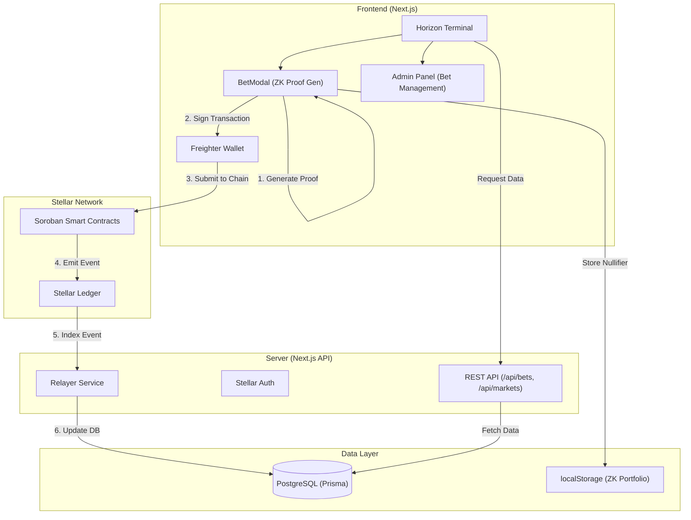

# 🌌 Horizon: Privacy-First Prediction Markets on Stellar

Horizon is a next-generation prediction market platform built on the Stellar blockchain, leveraging Soroban smart contracts and Zero-Knowledge (ZK) proofs to ensure trader privacy while providing high-fidelity market intelligence.


---

## 📖 Project Description

Horizon redefines prediction markets by prioritizing user privacy and data integrity. By integrating **Zero-Knowledge Proofs (ZKPs)** on the **Stellar Network**, Horizon allows users to take positions on global events without revealing their specific bets until the market is resolved. This prevents front-running and manipulation, creating a fairer ecosystem for all participants.

---

## ✨ Key Features

- **🔐 Privacy via ZK Proofs**: All bets are placed as ZK commitments. Positions remain private until the "Reveal" phase.
- **⚡ Stellar/Soroban Integration**: High-speed, low-cost settlement using Stellar's latest smart contract engine.
- **📊 Intelligence Dashboard**: Real-time analysis of market quality, risk scores, and sentiment trends.
- **🛡️ Secure Escrow**: Non-custodial escrow contracts manage user funds with cryptographic certainty.
- **🔍 Manipulation Detection**: Automated systems flag suspicious trading patterns to ensure market health.

---

## 🏗️ Architecture



---

## 📜 Smartcontract Details

Horizon's core logic is governed by a Soroban smart contract deployed on the Stellar Testnet.

- **Contract ID**: `CAIU27X7UNPW3ZOG27CQAFNZODL3F2DFVZRBUZS6G2NFX7WWANBXN356`
- **Network**: Stellar Testnet
- **Explorer**: [Stellar.Expert View](https://stellar.expert/explorer/testnet/contract/CAIU27X7UNPW3ZOG27CQAFNZODL3F2DFVZRBUZS6G2NFX7WWANBXN356)

### Contract Deployment Screenshot


---

## 🌟 Project Vision

To establish the gold standard for decentralized prediction markets where privacy is not a luxury, but a fundamental right. Horizon aims to empower the global community with a transparent yet private platform for forecasting the future.

---

## 🚀 Future Scope

1.  **AI Market Curator**: Automated market creation and liquidity provisioning using LLMs.
2.  **Cross-Chain Bridging**: Expanding to other ZK-friendly ecosystems like Ethereum (L2) and Polygon.
3.  **Mobile App**: Immersive mobile experience with hardware-level ZK proof generation.
4.  **Advanced Oracle Network**: Integration with decentralized oracle providers for automated resolution.

---

### 🖼️ UI Screenshots

#### 🚀 Main Dashboard


#### 🌍 Global Markets


#### 📊 Market Overview & Analysis


#### 💼 User Portfolio


#### 🏆 Leaderboard


#### 🔐 Admin Panel: Transaction Stream


#### ⚖️ Admin Panel: Market Resolution


#### ⛓️ On-Chain ZK Transaction


---

## 📝 User Feedback

We value community input and actively iterate on our platform based on user experiences.

**[View Full User Feedback Response Sheet](https://docs.google.com/spreadsheets/d/1ZWrlcff79a274MHBfSEh__zPHHFg-faftsk7UUYXess/edit?resourcekey=&gid=510073230#gid=510073230)**

### Feedback Summary & Implementation

| User Name | User Email | User Wallet Address | User Feedback | Commit ID |
| :--- | :--- | :--- | :--- | :--- |
| Nilarpan Jana | nnilarpan@gmail.com | GCQM3XP3IWUY3LCPDIP4QRLB7VIL2DY2QLZJ2KG2NANWUAFAZ3ULECUQ | Appreciated the unique markets and focus on security/decentralization. Suggested UX improvements for navigation. | [8512a70](https://github.com/Subho4531/eventhorizon/commit/8512a70) |

---

## 🚀 Getting Started

### Prerequisites
- Node.js 20+
- PostgreSQL instance
- Freighter Wallet extension

### Installation

1. **Clone the repository**:
   ```bash
   git clone https://github.com/Subho4531/eventhorizon.git
   cd eventhorizon
   ```

2. **Install dependencies**:
   ```bash
   npm install
   ```

3. **Environment Setup**:
   Copy `.env.example` to `.env` and fill in your credentials:
   ```bash
   cp .env.example .env
   ```

4. **Database Migration**:
   ```bash
   npx prisma migrate dev
   ```

5. **Run the development server**:
   ```bash
   npm run dev
   ```

---

## 🛠️ Tech Stack

- **Frontend**: Next.js 15 (App Router), Tailwind CSS, Framer Motion
- **Blockchain**: Stellar (Soroban), Freighter Wallet, Stellar SDK
- **Backend**: Next.js API Routes, Prisma ORM
- **Database**: PostgreSQL
- **Security**: Zero-Knowledge Proofs (Circuit Layer)
- **Testing**: Vitest, Property-Based Testing (PBT)

---

## 📂 Project Structure

```text
├── app/               # Next.js App Router (Pages & API)
├── components/        # Reusable UI components
├── contracts/         # Soroban Smart Contracts (Rust)
├── lib/               # Shared utilities & blockchain logic
├── prisma/            # Database schema & migrations
├── public/            # Static assets
├── scripts/           # Deployment & maintenance scripts
└── tests/             # Unit & integration tests
```

---

## 📜 License

This project is licensed under the MIT License.
