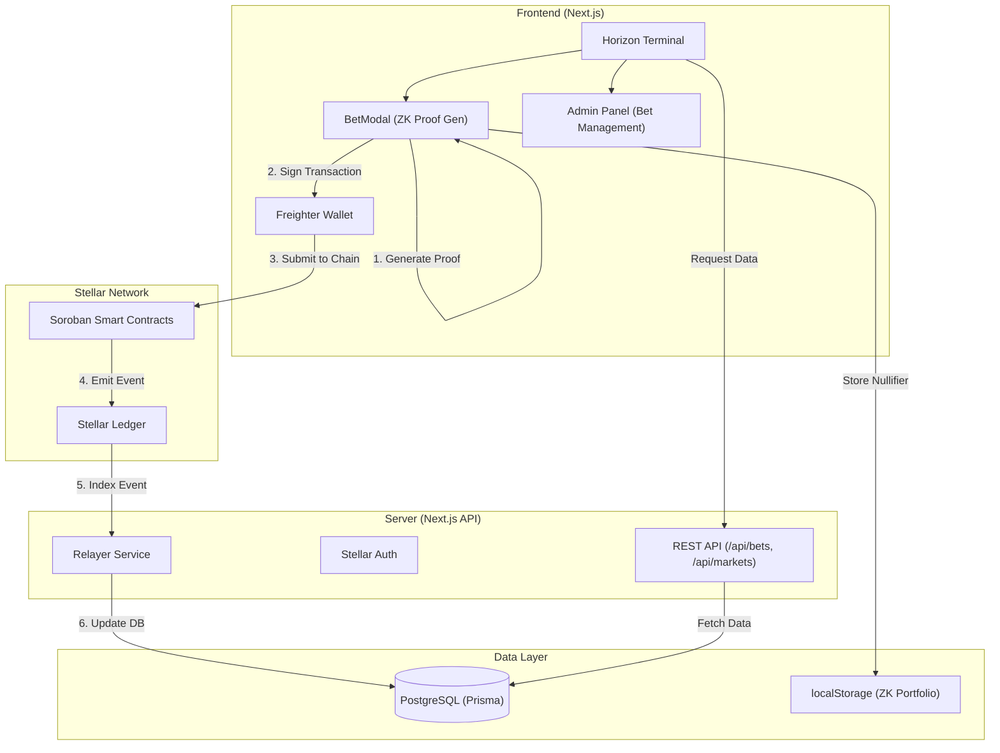
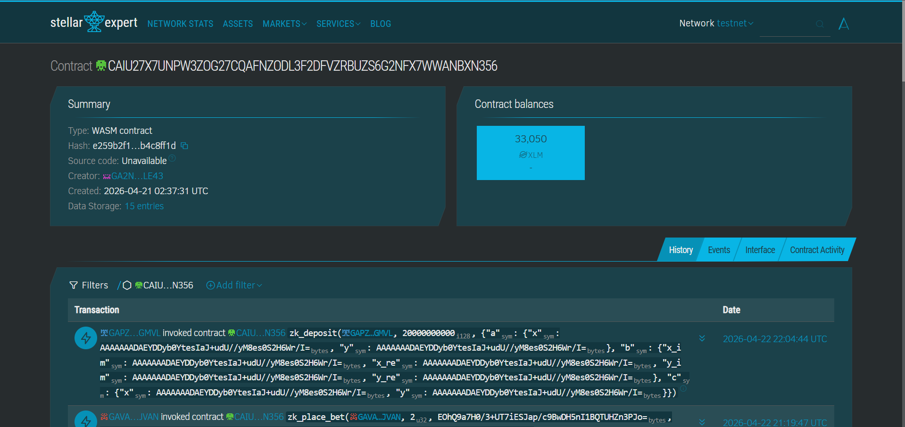
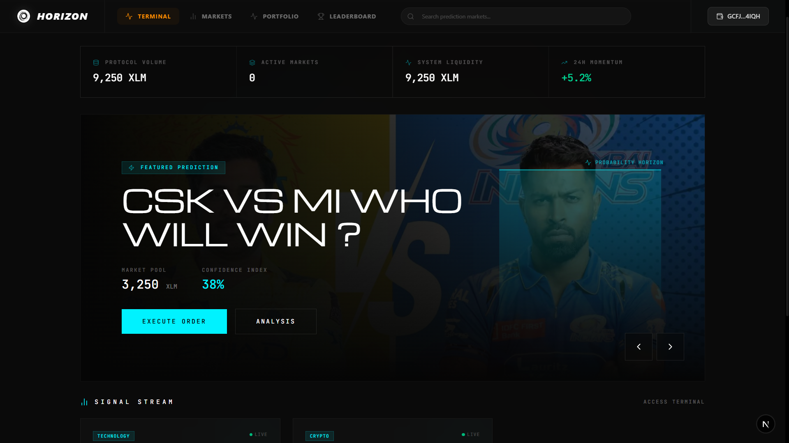
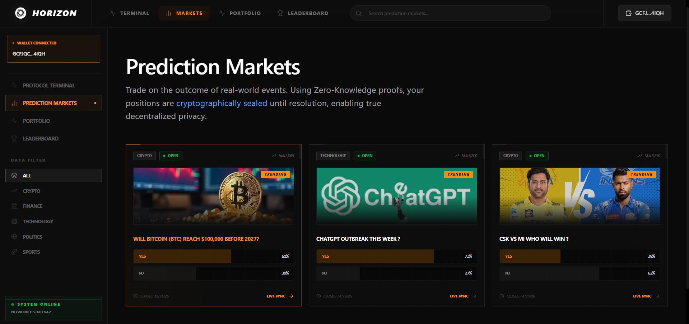
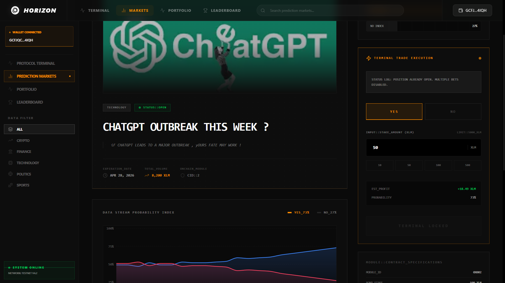
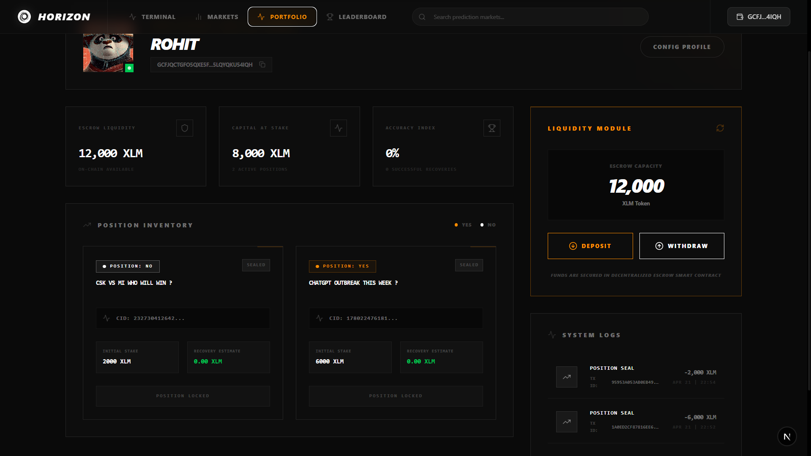
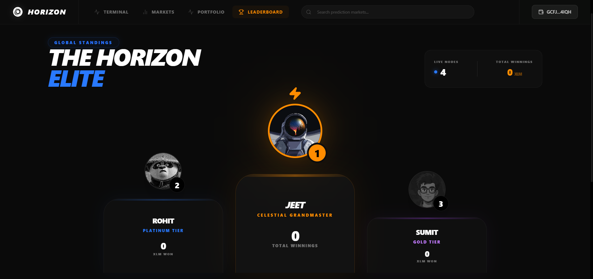
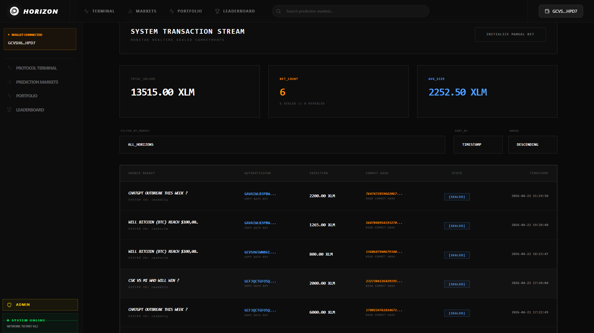
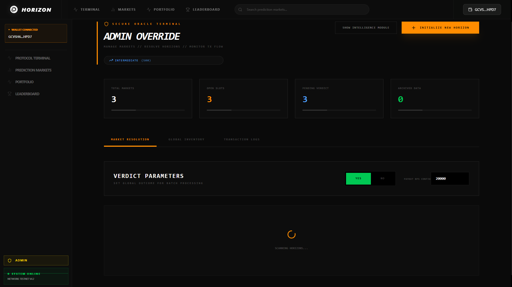
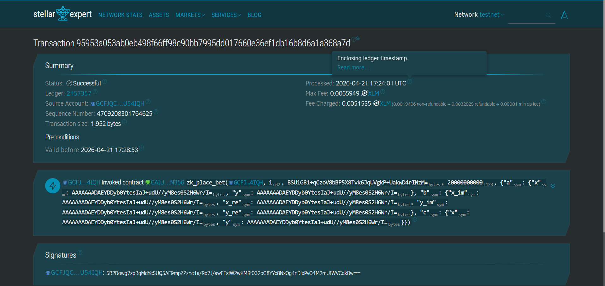

# 🌌 Horizon: Privacy-First Prediction Markets on Stellar

Horizon is a next-generation prediction market platform built on the Stellar blockchain, leveraging Soroban smart contracts and Zero-Knowledge (ZK) proofs to ensure trader privacy while providing high-fidelity market intelligence.

[](https://horizonmarkets.vercel.app/)
[](https://github.com/Subho4531/eventhorizon)


---

## 📖 Project Description

Horizon redefines prediction markets by prioritizing user privacy and data integrity. By integrating **Zero-Knowledge Proofs (ZKPs)** on the **Stellar Network**, Horizon allows users to take positions on global events without revealing their specific bets until the market is resolved. This prevents front-running and manipulation, creating a fairer ecosystem for all participants.

---

## 🎥 Video Demo

Experience Horizon in action:

[](https://youtu.be/zxn6RVdhBBU)

*Watch the full walkthrough of the Privacy-First Prediction Market on Stellar.*

---

## ✨ Key Features

- **🔐 Privacy via ZK Proofs**: All bets are placed as ZK commitments. Positions remain private until the "Reveal" phase.
- **⚡ Stellar/Soroban Integration**: High-speed, low-cost settlement using Stellar's latest smart contract engine.
- **📊 Intelligence Dashboard**: Real-time analysis of market quality, risk scores, and sentiment trends.
- **🛡️ Secure Escrow**: Non-custodial escrow contracts manage user funds with cryptographic certainty.
- **🔍 Manipulation Detection**: Automated systems flag suspicious trading patterns to ensure market health.

---

## 🏗️ Architecture



---

## 📜 Smartcontract Details

Horizon's core logic is governed by a Soroban smart contract deployed on the Stellar Testnet.

- **Contract ID**: `CAIU27X7UNPW3ZOG27CQAFNZODL3F2DFVZRBUZS6G2NFX7WWANBXN356`
- **Network**: Stellar Testnet
- **Explorer**: [Stellar.Expert View](https://stellar.expert/explorer/testnet/contract/CAIU27X7UNPW3ZOG27CQAFNZODL3F2DFVZRBUZS6G2NFX7WWANBXN356)

### Contract Deployment Screenshot


---

## 🌟 Project Vision

Horizon's mission is to build the world's most trusted, private, and intelligence-driven prediction market ecosystem. We believe that **Privacy is a Human Right**, and in the realm of prediction markets, it is the key to preventing manipulation and ensuring that the "Wisdom of the Crowd" is truly unbiased.

*   **Decentralized Truth**: Leveraging Stellar's immutable ledger to create a transparent source of record for global events.
*   **Privacy by Default**: Using Zero-Knowledge Proofs to protect individual strategies and positions.
*   **Intelligence-First**: Moving beyond simple betting to provide high-fidelity sentiment analysis and risk metrics.
*   **Global Empowerment**: Providing anyone, anywhere, with the tools to hedge against future uncertainty.

---

## 🚀 Future Scope

The journey has just begun. Our roadmap for the next 12-18 months includes:

1.  **🤖 Horizon AI Curator**: Integrating Large Language Models to automatically create markets from real-time news feeds and manage liquidity.
2.  **🌐 Cross-Chain ZK-Rollups**: Expanding Horizon's privacy primitives to Ethereum, Polygon, and beyond via decentralized bridges.
3.  **📱 Mobile-Native Experience**: A high-performance mobile app featuring biometric-secured ZK proof generation and instant push alerts.
4.  **🏦 Institutional Liquidity Pools**: Specialized vaults for market makers and institutional hedgers with advanced risk management tools.
5.  **🛰️ Decentralized Oracle Network**: A bespoke oracle system utilizing multi-party computation (MPC) for automated and dispute-free resolutions.
6.  **🎮 Gamified Prediction Tiers**: Introducing reputation-based tiers, social trading leaderboards, and ZK-verified performance badges.

---

### 🖼️ UI Screenshots

#### 🚀 Main Dashboard


#### 🌍 Global Markets


#### 📊 Market Overview & Analysis


#### 💼 User Portfolio


#### 🏆 Leaderboard


#### 🔐 Admin Panel: Transaction Stream


#### ⚖️ Admin Panel: Market Resolution


#### ⛓️ On-Chain ZK Transaction


---

## 📝 User Feedback

We value community input and actively iterate on our platform based on user experiences.

**[View Full User Feedback Response Sheet](https://docs.google.com/spreadsheets/d/1ZWrlcff79a274MHBfSEh__zPHHFg-faftsk7UUYXess/edit?resourcekey=&gid=510073230#gid=510073230)**

### 💬 Feedback Summary & Implementation

| User Name | User Wallet Address | User Feedback | Commit ID |
| :--- | :--- | :--- | :--- |
| **Nilarpan Jana** | `GCQM3X...Z3ULECUQ` | Appreciated unique markets and security. Suggested UX navigation tweaks. | [`6bbb519`](https://github.com/Subho4531/eventhorizon/commit/6bbb519) |
| **Sumit Sarkar** | `GAVAIW...H3AJVAN` | Excellent decentralization focus. Suggested optimizing app loading times. | [`8512a70`](https://github.com/Subho4531/eventhorizon/commit/8512a70) |

> [!TIP]
> We actively monitor the [User Feedback Response Sheet](https://docs.google.com/spreadsheets/d/1ZWrlcff79a274MHBfSEh__zPHHFg-faftsk7UUYXess/edit?resourcekey=&gid=510073230#gid=510073230) for continuous improvements.

---

## 🚀 Getting Started

### Prerequisites
- Node.js 20+
- PostgreSQL instance
- Freighter Wallet extension

### Installation

1. **Clone the repository**:
   ```bash
   git clone https://github.com/Subho4531/eventhorizon.git
   cd eventhorizon
   ```

2. **Install dependencies**:
   ```bash
   npm install
   ```

3. **Environment Setup**:
   Copy `.env.example` to `.env` and fill in your credentials:
   ```bash
   cp .env.example .env
   ```

4. **Database Migration**:
   ```bash
   npx prisma migrate dev
   ```

5. **Run the development server**:
   ```bash
   npm run dev
   ```

---

## 🛠️ Tech Stack
Horizon is built using a modern, high-performance stack optimized for security and scale.

- **Frontend**:   
- **Blockchain**:   
- **Backend**:  
- **Database**: 
- **Security**:  
- **Testing**: 

---

## 📂 Project Structure

```text
├── app/               # Next.js App Router (Pages & API)
├── components/        # Reusable UI components
├── contracts/         # Soroban Smart Contracts (Rust)
├── lib/               # Shared utilities & blockchain logic
├── prisma/            # Database schema & migrations
├── public/            # Static assets
├── scripts/           # Deployment & maintenance scripts
└── tests/             # Unit & integration tests
```

---

## 🤝 Contributing

We welcome contributions from the community! Whether you're fixing a bug, suggesting a feature, or improving documentation, your help is appreciated.

1.  **Fork** the repository.
2.  **Create a branch** (`git checkout -b feature/AmazingFeature`).
3.  **Commit** your changes (`git commit -m 'Add some AmazingFeature'`).
4.  **Push** to the branch (`git push origin feature/AmazingFeature`).
5.  **Open a Pull Request**.

---

## 📜 License

This project is licensed under the MIT License.

---
<p align="center">Made with ❤️ for the Stellar Ecosystem</p>
